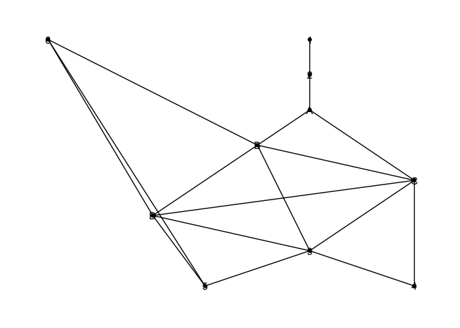
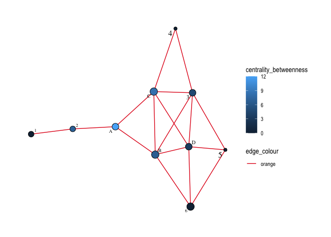

Exercise 2
================

## Loading libraries

``` r
library(dplyr)
```

    ## 
    ## Attaching package: 'dplyr'

    ## The following objects are masked from 'package:stats':
    ## 
    ##     filter, lag

    ## The following objects are masked from 'package:base':
    ## 
    ##     intersect, setdiff, setequal, union

``` r
library(tidygraph)
```

    ## 
    ## Attaching package: 'tidygraph'

    ## The following object is masked from 'package:stats':
    ## 
    ##     filter

``` r
library(tidyverse)
```

    ## ── Attaching packages ─────────────────────────────────────── tidyverse 1.3.1 ──

    ## ✔ ggplot2 3.3.5     ✔ purrr   0.3.4
    ## ✔ tibble  3.1.6     ✔ stringr 1.4.0
    ## ✔ tidyr   1.2.0     ✔ forcats 0.5.1
    ## ✔ readr   2.1.2

    ## ── Conflicts ────────────────────────────────────────── tidyverse_conflicts() ──
    ## ✖ tidygraph::filter() masks dplyr::filter(), stats::filter()
    ## ✖ dplyr::lag()        masks stats::lag()

``` r
library(ggraph)
```

## Creating nodes and edges

###### Nodes: \[1,2,3,4,5,6,A,B,C,D\]

###### Connections between ‘nodes’:

6 -> 5, 6 -> D, 6 -> B, 1 -> 2, 2 -> A, A -> B, A -> C, B -> C, B -> D,
B -> 3, C -> D, C -> 3, C -> 4, D -> 3, D -> 5, 3 -> 5, 3 -> 4

###### Load CSV file that contains the edge table

``` r
bus_network <- read.csv('fb_bus.csv')
bus_network
```

    ##    node_1 node_2
    ## 1       6      5
    ## 2       6      D
    ## 3       6      B
    ## 4       1      2
    ## 5       2      A
    ## 6       A      B
    ## 7       A      C
    ## 8       B      C
    ## 9       B      D
    ## 10      B      3
    ## 11      C      D
    ## 12      C      3
    ## 13      C      4
    ## 14      D      3
    ## 15      D      5
    ## 16      3      5
    ## 17      3      4

### Create network graph

``` r
bus_graph = as_tbl_graph(bus_network)
```

### Plotting network graph

``` r
ggraph(bus_graph) + 
  geom_edge_link() + 
  geom_node_point()+
  geom_node_text(aes(label = name)) +
  theme_graph()
```

    ## Using `sugiyama` as default layout

<!-- -->

### Calculating metrics

###### Degree centrality - how many edge connections for each node

``` r
# add results to graph
bus_graph =bus_graph %>%
  activate(nodes) %>%
  mutate(centrality_degree = centrality_degree())

bus_graph
```

    ## # A tbl_graph: 10 nodes and 17 edges
    ## #
    ## # A directed acyclic simple graph with 1 component
    ## #
    ## # Node Data: 10 × 2 (active)
    ##   name  centrality_degree
    ##   <chr>             <dbl>
    ## 1 6                     3
    ## 2 1                     1
    ## 3 2                     1
    ## 4 A                     2
    ## 5 B                     3
    ## 6 C                     3
    ## # … with 4 more rows
    ## #
    ## # Edge Data: 17 × 2
    ##    from    to
    ##   <int> <int>
    ## 1     1     9
    ## 2     1     7
    ## 3     1     5
    ## # … with 14 more rows

###### Betweenness centrality - using shortest paths

``` r
# add results to graph
bus_graph = bus_graph %>%
  activate(nodes) %>%
  mutate(centrality_betweenness = centrality_betweenness())
```

    ## Warning in betweenness(graph = graph, v = V(graph), directed = directed, :
    ## 'nobigint' is deprecated since igraph 1.3 and will be removed in igraph 1.4

``` r
bus_graph
```

    ## # A tbl_graph: 10 nodes and 17 edges
    ## #
    ## # A directed acyclic simple graph with 1 component
    ## #
    ## # Node Data: 10 × 3 (active)
    ##   name  centrality_degree centrality_betweenness
    ##   <chr>             <dbl>                  <dbl>
    ## 1 6                     3                   0   
    ## 2 1                     1                   0   
    ## 3 2                     1                   7   
    ## 4 A                     2                  12   
    ## 5 B                     3                   6.67
    ## 6 C                     3                   8.33
    ## # … with 4 more rows
    ## #
    ## # Edge Data: 17 × 2
    ##    from    to
    ##   <int> <int>
    ## 1     1     9
    ## 2     1     7
    ## 3     1     5
    ## # … with 14 more rows

###### Closeness centrality - how close to all other nodes

``` r
# add results to graph
bus_graph = bus_graph %>%
  activate(nodes) %>%
  mutate(centrality_closeness = centrality_closeness())

bus_graph
```

    ## # A tbl_graph: 10 nodes and 17 edges
    ## #
    ## # A directed acyclic simple graph with 1 component
    ## #
    ## # Node Data: 10 × 4 (active)
    ##   name  centrality_degree centrality_betweenness centrality_closeness
    ##   <chr>             <dbl>                  <dbl>                <dbl>
    ## 1 6                     3                   0                  0.1   
    ## 2 1                     1                   0                  0.0385
    ## 3 2                     1                   7                  0.0556
    ## 4 A                     2                  12                  0.0909
    ## 5 B                     3                   6.67               0.143 
    ## 6 C                     3                   8.33               0.2   
    ## # … with 4 more rows
    ## #
    ## # Edge Data: 17 × 2
    ##    from    to
    ##   <int> <int>
    ## 1     1     9
    ## 2     1     7
    ## 3     1     5
    ## # … with 14 more rows

### Let’s look at the metrics for only the nodes where it is possible to sit

``` r
bus_graph_options <- bus_graph %>% 
  filter(name %in% c('A','B','C','D'))

bus_graph_options
```

    ## # A tbl_graph: 4 nodes and 5 edges
    ## #
    ## # A directed acyclic simple graph with 1 component
    ## #
    ## # Node Data: 4 × 4 (active)
    ##   name  centrality_degree centrality_betweenness centrality_closeness
    ##   <chr>             <dbl>                  <dbl>                <dbl>
    ## 1 A                     2                  12                  0.0909
    ## 2 B                     3                   6.67               0.143 
    ## 3 C                     3                   8.33               0.2   
    ## 4 D                     2                   3.33               0.25  
    ## #
    ## # Edge Data: 5 × 2
    ##    from    to
    ##   <int> <int>
    ## 1     1     2
    ## 2     1     3
    ## 3     2     3
    ## # … with 2 more rows

### Discuss possible consequences of your choice of a seat. When would this choice be beneficial? When would it be not so beneficial?

The best option to sit would be the seat that has relatively higher
values in each of the metrics in comparison to the other seats. This
option is C, which would give one of the highest degree centralities,
the option to speak to multiple people on the bus. It also has one of
the higher values for betweenness and closeness centrality, which would
mean that seat would more likely serve as a bridge of communication or
information sharing between other seats. However, if the main objective
if to serve as a bridge in between others, the best option would have
been seat A

### Plot the network graph with labels and centrality values

``` r
#install.packages("graphlayouts")
library(graphlayouts)
```

``` r
ggraph(bus_graph, "stress", bbox = 15) +
  geom_edge_link2(aes(edge_colour = "orange"), edge_width = 0.5) +
  geom_node_point(aes(fill = centrality_betweenness, size = centrality_degree), shape = 21) +
  geom_node_text(aes(label = name, size=centrality_closeness),
    family = "serif", repel = TRUE
  ) +
  scale_edge_colour_brewer(palette = "Set1") +
  scale_size(range = c(2, 5), guide = "none") +
  theme_graph() 
```

<!-- --> ######
The above plot colors the nodes based on centrality measures, with the
lightest blue nodes having the highest betweenness centrality values.
Larger nodes and label sizes also show higher degree centrality and
closeness centrality values respectively.
