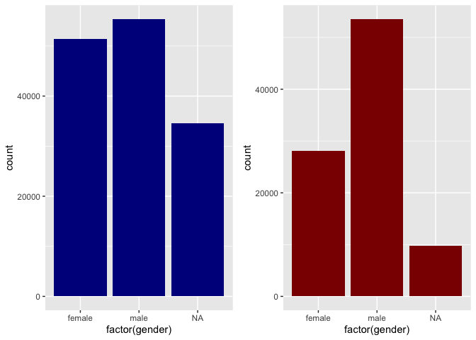
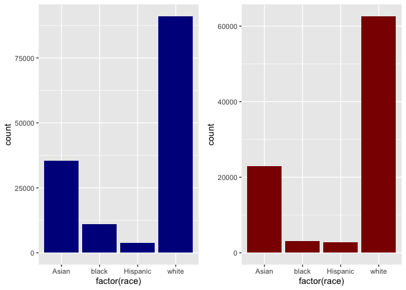
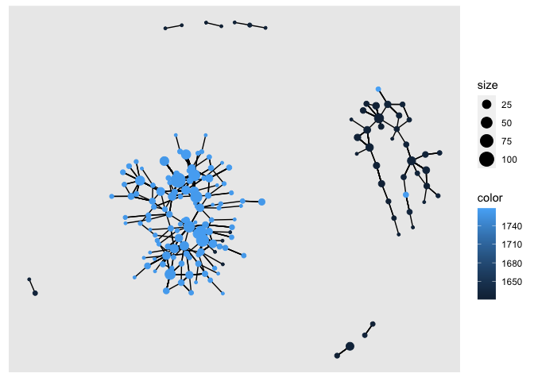
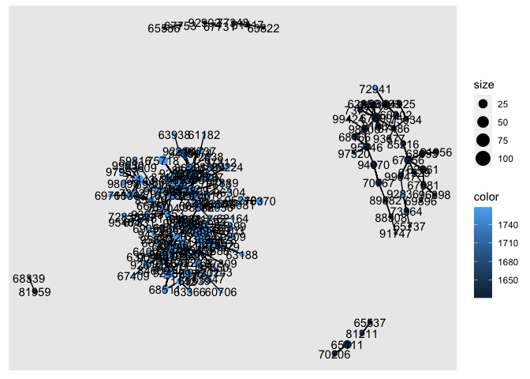

Exercise 3
================

## Load the files

You can include R code in the document as follows:

``` r
# change to your own path!
data_path <- "/Users/tehuttesfayebiru/projects/2022-ona-assignments/exercises/"
applications <- read_parquet(paste0(data_path,"app_data_sample.parquet"))
edges <- read_csv(paste0(data_path,"edges_sample.csv"))
```

    ## Rows: 32906 Columns: 4
    ## ── Column specification ────────────────────────────────────────────────────────
    ## Delimiter: ","
    ## chr  (1): application_number
    ## dbl  (2): ego_examiner_id, alter_examiner_id
    ## date (1): advice_date
    ## 
    ## ℹ Use `spec()` to retrieve the full column specification for this data.
    ## ℹ Specify the column types or set `show_col_types = FALSE` to quiet this message.

``` r
applications
```

    ## # A tibble: 2,018,477 × 16
    ##    application_number filing_date examiner_name_last examiner_name_first
    ##    <chr>              <date>      <chr>              <chr>              
    ##  1 08284457           2000-01-26  HOWARD             JACQUELINE         
    ##  2 08413193           2000-10-11  YILDIRIM           BEKIR              
    ##  3 08531853           2000-05-17  HAMILTON           CYNTHIA            
    ##  4 08637752           2001-07-20  MOSHER             MARY               
    ##  5 08682726           2000-04-10  BARR               MICHAEL            
    ##  6 08687412           2000-04-28  GRAY               LINDA              
    ##  7 08716371           2004-01-26  MCMILLIAN          KARA               
    ##  8 08765941           2000-06-23  FORD               VANESSA            
    ##  9 08776818           2000-02-04  STRZELECKA         TERESA             
    ## 10 08809677           2002-02-20  KIM                SUN                
    ## # … with 2,018,467 more rows, and 12 more variables:
    ## #   examiner_name_middle <chr>, examiner_id <dbl>, examiner_art_unit <dbl>,
    ## #   uspc_class <chr>, uspc_subclass <chr>, patent_number <chr>,
    ## #   patent_issue_date <date>, abandon_date <date>, disposal_type <chr>,
    ## #   appl_status_code <dbl>, appl_status_date <chr>, tc <dbl>

``` r
edges
```

    ## # A tibble: 32,906 × 4
    ##    application_number advice_date ego_examiner_id alter_examiner_id
    ##    <chr>              <date>                <dbl>             <dbl>
    ##  1 09402488           2008-11-17            84356             66266
    ##  2 09402488           2008-11-17            84356             63519
    ##  3 09402488           2008-11-17            84356             98531
    ##  4 09445135           2008-08-21            92953             71313
    ##  5 09445135           2008-08-21            92953             93865
    ##  6 09445135           2008-08-21            92953             91818
    ##  7 09479304           2008-12-15            61767             69277
    ##  8 09479304           2008-12-15            61767             92446
    ##  9 09479304           2008-12-15            61767             66805
    ## 10 09479304           2008-12-15            61767             70919
    ## # … with 32,896 more rows

## add the following variables for examiners: Gender, Race, Tenure

## Gender

``` r
# get a list of first names without repetitions
# get a list of first names without repetitions
examiner_names <- applications %>% 
  distinct(examiner_name_first)

examiner_names
```

    ## # A tibble: 2,595 × 1
    ##    examiner_name_first
    ##    <chr>              
    ##  1 JACQUELINE         
    ##  2 BEKIR              
    ##  3 CYNTHIA            
    ##  4 MARY               
    ##  5 MICHAEL            
    ##  6 LINDA              
    ##  7 KARA               
    ##  8 VANESSA            
    ##  9 TERESA             
    ## 10 SUN                
    ## # … with 2,585 more rows

``` r
# get a table of names and gender
examiner_names_gender <- examiner_names %>% 
  do(results = gender(.$examiner_name_first, method = "ssa")) %>% 
  unnest(cols = c(results), keep_empty = TRUE) %>% 
  select(
    examiner_name_first = name,
    gender,
    proportion_female
  )

examiner_names_gender
```

    ## # A tibble: 1,822 × 3
    ##    examiner_name_first gender proportion_female
    ##    <chr>               <chr>              <dbl>
    ##  1 AARON               male              0.0082
    ##  2 ABDEL               male              0     
    ##  3 ABDOU               male              0     
    ##  4 ABDUL               male              0     
    ##  5 ABDULHAKIM          male              0     
    ##  6 ABDULLAH            male              0     
    ##  7 ABDULLAHI           male              0     
    ##  8 ABIGAIL             female            0.998 
    ##  9 ABIMBOLA            female            0.944 
    ## 10 ABRAHAM             male              0.0031
    ## # … with 1,812 more rows

``` r
# remove extra colums from the gender table
examiner_names_gender <- examiner_names_gender %>% 
  select(examiner_name_first, gender)

# joining gender back to the dataset
applications <- applications %>% 
  left_join(examiner_names_gender, by = "examiner_name_first")

# cleaning up
rm(examiner_names)
rm(examiner_names_gender)
gc()
```

    ##            used  (Mb) gc trigger  (Mb) limit (Mb) max used  (Mb)
    ## Ncells  4609408 246.2    7916501 422.8         NA  5013086 267.8
    ## Vcells 49826912 380.2   95803343 731.0      16384 80142720 611.5

``` r
applications
```

    ## # A tibble: 2,018,477 × 17
    ##    application_number filing_date examiner_name_last examiner_name_first
    ##    <chr>              <date>      <chr>              <chr>              
    ##  1 08284457           2000-01-26  HOWARD             JACQUELINE         
    ##  2 08413193           2000-10-11  YILDIRIM           BEKIR              
    ##  3 08531853           2000-05-17  HAMILTON           CYNTHIA            
    ##  4 08637752           2001-07-20  MOSHER             MARY               
    ##  5 08682726           2000-04-10  BARR               MICHAEL            
    ##  6 08687412           2000-04-28  GRAY               LINDA              
    ##  7 08716371           2004-01-26  MCMILLIAN          KARA               
    ##  8 08765941           2000-06-23  FORD               VANESSA            
    ##  9 08776818           2000-02-04  STRZELECKA         TERESA             
    ## 10 08809677           2002-02-20  KIM                SUN                
    ## # … with 2,018,467 more rows, and 13 more variables:
    ## #   examiner_name_middle <chr>, examiner_id <dbl>, examiner_art_unit <dbl>,
    ## #   uspc_class <chr>, uspc_subclass <chr>, patent_number <chr>,
    ## #   patent_issue_date <date>, abandon_date <date>, disposal_type <chr>,
    ## #   appl_status_code <dbl>, appl_status_date <chr>, tc <dbl>, gender <chr>

## Race

``` r
library(wru)

examiner_surnames <- applications %>% 
  select(surname = examiner_name_last) %>% 
  distinct()

examiner_surnames
```

    ## # A tibble: 3,806 × 1
    ##    surname   
    ##    <chr>     
    ##  1 HOWARD    
    ##  2 YILDIRIM  
    ##  3 HAMILTON  
    ##  4 MOSHER    
    ##  5 BARR      
    ##  6 GRAY      
    ##  7 MCMILLIAN 
    ##  8 FORD      
    ##  9 STRZELECKA
    ## 10 KIM       
    ## # … with 3,796 more rows

``` r
examiner_race <- predict_race(voter.file = examiner_surnames, surname.only = T) %>% 
  as_tibble()
```

    ## [1] "Proceeding with surname-only predictions..."

    ## Warning in merge_surnames(voter.file): Probabilities were imputed for 698
    ## surnames that could not be matched to Census list.

``` r
examiner_race
```

    ## # A tibble: 3,806 × 6
    ##    surname    pred.whi pred.bla pred.his pred.asi pred.oth
    ##    <chr>         <dbl>    <dbl>    <dbl>    <dbl>    <dbl>
    ##  1 HOWARD       0.643   0.295    0.0237   0.005     0.0333
    ##  2 YILDIRIM     0.861   0.0271   0.0609   0.0135    0.0372
    ##  3 HAMILTON     0.702   0.237    0.0245   0.0054    0.0309
    ##  4 MOSHER       0.947   0.00410  0.0241   0.00640   0.0185
    ##  5 BARR         0.827   0.117    0.0226   0.00590   0.0271
    ##  6 GRAY         0.687   0.251    0.0241   0.0054    0.0324
    ##  7 MCMILLIAN    0.359   0.574    0.0189   0.00260   0.0463
    ##  8 FORD         0.620   0.32     0.0237   0.0045    0.0313
    ##  9 STRZELECKA   0.666   0.0853   0.137    0.0797    0.0318
    ## 10 KIM          0.0252  0.00390  0.00650  0.945     0.0198
    ## # … with 3,796 more rows

``` r
examiner_race <- examiner_race %>% 
  mutate(max_race_p = pmax(pred.asi, pred.bla, pred.his, pred.oth, pred.whi)) %>% 
  mutate(race = case_when(
    max_race_p == pred.asi ~ "Asian",
    max_race_p == pred.bla ~ "black",
    max_race_p == pred.his ~ "Hispanic",
    max_race_p == pred.oth ~ "other",
    max_race_p == pred.whi ~ "white",
    TRUE ~ NA_character_
  ))

examiner_race
```

    ## # A tibble: 3,806 × 8
    ##    surname    pred.whi pred.bla pred.his pred.asi pred.oth max_race_p race 
    ##    <chr>         <dbl>    <dbl>    <dbl>    <dbl>    <dbl>      <dbl> <chr>
    ##  1 HOWARD       0.643   0.295    0.0237   0.005     0.0333      0.643 white
    ##  2 YILDIRIM     0.861   0.0271   0.0609   0.0135    0.0372      0.861 white
    ##  3 HAMILTON     0.702   0.237    0.0245   0.0054    0.0309      0.702 white
    ##  4 MOSHER       0.947   0.00410  0.0241   0.00640   0.0185      0.947 white
    ##  5 BARR         0.827   0.117    0.0226   0.00590   0.0271      0.827 white
    ##  6 GRAY         0.687   0.251    0.0241   0.0054    0.0324      0.687 white
    ##  7 MCMILLIAN    0.359   0.574    0.0189   0.00260   0.0463      0.574 black
    ##  8 FORD         0.620   0.32     0.0237   0.0045    0.0313      0.620 white
    ##  9 STRZELECKA   0.666   0.0853   0.137    0.0797    0.0318      0.666 white
    ## 10 KIM          0.0252  0.00390  0.00650  0.945     0.0198      0.945 Asian
    ## # … with 3,796 more rows

``` r
# removing extra columns
examiner_race <- examiner_race %>% 
  select(surname,race)

applications <- applications %>% 
  left_join(examiner_race, by = c("examiner_name_last" = "surname"))

rm(examiner_race)
rm(examiner_surnames)
gc()
```

    ##            used  (Mb) gc trigger  (Mb) limit (Mb) max used  (Mb)
    ## Ncells  5024145 268.4    7916501 422.8         NA  7916501 422.8
    ## Vcells 53623557 409.2   95803343 731.0      16384 94813642 723.4

``` r
applications
```

    ## # A tibble: 2,018,477 × 18
    ##    application_number filing_date examiner_name_last examiner_name_first
    ##    <chr>              <date>      <chr>              <chr>              
    ##  1 08284457           2000-01-26  HOWARD             JACQUELINE         
    ##  2 08413193           2000-10-11  YILDIRIM           BEKIR              
    ##  3 08531853           2000-05-17  HAMILTON           CYNTHIA            
    ##  4 08637752           2001-07-20  MOSHER             MARY               
    ##  5 08682726           2000-04-10  BARR               MICHAEL            
    ##  6 08687412           2000-04-28  GRAY               LINDA              
    ##  7 08716371           2004-01-26  MCMILLIAN          KARA               
    ##  8 08765941           2000-06-23  FORD               VANESSA            
    ##  9 08776818           2000-02-04  STRZELECKA         TERESA             
    ## 10 08809677           2002-02-20  KIM                SUN                
    ## # … with 2,018,467 more rows, and 14 more variables:
    ## #   examiner_name_middle <chr>, examiner_id <dbl>, examiner_art_unit <dbl>,
    ## #   uspc_class <chr>, uspc_subclass <chr>, patent_number <chr>,
    ## #   patent_issue_date <date>, abandon_date <date>, disposal_type <chr>,
    ## #   appl_status_code <dbl>, appl_status_date <chr>, tc <dbl>, gender <chr>,
    ## #   race <chr>

## Tenure

``` r
library(lubridate) # to work with dates
```

    ## 
    ## Attaching package: 'lubridate'

    ## The following object is masked from 'package:arrow':
    ## 
    ##     duration

    ## The following objects are masked from 'package:base':
    ## 
    ##     date, intersect, setdiff, union

``` r
examiner_dates <- applications %>% 
  select(examiner_id, filing_date, appl_status_date) 

examiner_dates
```

    ## # A tibble: 2,018,477 × 3
    ##    examiner_id filing_date appl_status_date  
    ##          <dbl> <date>      <chr>             
    ##  1       96082 2000-01-26  30jan2003 00:00:00
    ##  2       87678 2000-10-11  27sep2010 00:00:00
    ##  3       63213 2000-05-17  30mar2009 00:00:00
    ##  4       73788 2001-07-20  07sep2009 00:00:00
    ##  5       77294 2000-04-10  19apr2001 00:00:00
    ##  6       68606 2000-04-28  16jul2001 00:00:00
    ##  7       89557 2004-01-26  15may2017 00:00:00
    ##  8       97543 2000-06-23  03apr2002 00:00:00
    ##  9       98714 2000-02-04  27nov2002 00:00:00
    ## 10       65530 2002-02-20  23mar2009 00:00:00
    ## # … with 2,018,467 more rows

``` r
examiner_dates <- examiner_dates %>% 
  mutate(start_date = ymd(filing_date), end_date = as_date(dmy_hms(appl_status_date)))
```

``` r
examiner_dates <- examiner_dates %>% 
  group_by(examiner_id) %>% 
  summarise(
    earliest_date = min(start_date, na.rm = TRUE), 
    latest_date = max(end_date, na.rm = TRUE),
    tenure_days = interval(earliest_date, latest_date) %/% days(1)
    ) %>% 
  filter(year(latest_date)<2018)

examiner_dates
```

    ## # A tibble: 5,625 × 4
    ##    examiner_id earliest_date latest_date tenure_days
    ##          <dbl> <date>        <date>            <dbl>
    ##  1       59012 2004-07-28    2015-07-24         4013
    ##  2       59025 2009-10-26    2017-05-18         2761
    ##  3       59030 2005-12-12    2017-05-22         4179
    ##  4       59040 2007-09-11    2017-05-23         3542
    ##  5       59052 2001-08-21    2007-02-28         2017
    ##  6       59054 2000-11-10    2016-12-23         5887
    ##  7       59055 2004-11-02    2007-12-26         1149
    ##  8       59056 2000-03-24    2017-05-22         6268
    ##  9       59074 2000-01-31    2017-03-17         6255
    ## 10       59081 2011-04-21    2017-05-19         2220
    ## # … with 5,615 more rows

``` r
applications <- applications %>% 
  left_join(examiner_dates, by = "examiner_id")

rm(examiner_dates)
gc()
```

    ##            used  (Mb) gc trigger   (Mb) limit (Mb)  max used   (Mb)
    ## Ncells  5038046 269.1   14286492  763.0         NA  14286492  763.0
    ## Vcells 66002027 503.6  138132813 1053.9      16384 137952626 1052.5

``` r
applications
```

    ## # A tibble: 2,018,477 × 21
    ##    application_number filing_date examiner_name_last examiner_name_first
    ##    <chr>              <date>      <chr>              <chr>              
    ##  1 08284457           2000-01-26  HOWARD             JACQUELINE         
    ##  2 08413193           2000-10-11  YILDIRIM           BEKIR              
    ##  3 08531853           2000-05-17  HAMILTON           CYNTHIA            
    ##  4 08637752           2001-07-20  MOSHER             MARY               
    ##  5 08682726           2000-04-10  BARR               MICHAEL            
    ##  6 08687412           2000-04-28  GRAY               LINDA              
    ##  7 08716371           2004-01-26  MCMILLIAN          KARA               
    ##  8 08765941           2000-06-23  FORD               VANESSA            
    ##  9 08776818           2000-02-04  STRZELECKA         TERESA             
    ## 10 08809677           2002-02-20  KIM                SUN                
    ## # … with 2,018,467 more rows, and 17 more variables:
    ## #   examiner_name_middle <chr>, examiner_id <dbl>, examiner_art_unit <dbl>,
    ## #   uspc_class <chr>, uspc_subclass <chr>, patent_number <chr>,
    ## #   patent_issue_date <date>, abandon_date <date>, disposal_type <chr>,
    ## #   appl_status_code <dbl>, appl_status_date <chr>, tc <dbl>, gender <chr>,
    ## #   race <chr>, earliest_date <date>, latest_date <date>, tenure_days <dbl>

## Pick two workgroups you want to focus on (remember that a workgroup is

## represented by the first 3 digits of `examiner_art_unit` value)

How do they compare on examiners’ demographics? Show summary statistics
and plots.

``` r
group_176 = applications[substr(applications$examiner_art_unit, 1,3)==176,]
group_162 = applications[substr(applications$examiner_art_unit, 1,3)==162,]
summary(group_176)
```

    ##  application_number  filing_date         examiner_name_last examiner_name_first
    ##  Length:91376       Min.   :2000-01-03   Length:91376       Length:91376       
    ##  Class :character   1st Qu.:2004-06-15   Class :character   Class :character   
    ##  Mode  :character   Median :2010-09-09   Mode  :character   Mode  :character   
    ##                     Mean   :2009-07-28                                         
    ##                     3rd Qu.:2013-11-14                                         
    ##                     Max.   :2017-05-03                                         
    ##                                                                                
    ##  examiner_name_middle  examiner_id    examiner_art_unit  uspc_class       
    ##  Length:91376         Min.   :59096   Min.   :1761      Length:91376      
    ##  Class :character     1st Qu.:66691   1st Qu.:1762      Class :character  
    ##  Mode  :character     Median :76370   Median :1763      Mode  :character  
    ##                       Mean   :80175   Mean   :1764                        
    ##                       3rd Qu.:94668   3rd Qu.:1765                        
    ##                       Max.   :99930   Max.   :1768                        
    ##                       NA's   :404                                         
    ##  uspc_subclass      patent_number      patent_issue_date   
    ##  Length:91376       Length:91376       Min.   :2000-06-06  
    ##  Class :character   Class :character   1st Qu.:2006-05-02  
    ##  Mode  :character   Mode  :character   Median :2012-11-20  
    ##                                        Mean   :2011-03-15  
    ##                                        3rd Qu.:2015-03-24  
    ##                                        Max.   :2017-06-20  
    ##                                        NA's   :38860       
    ##   abandon_date        disposal_type      appl_status_code appl_status_date  
    ##  Min.   :1965-07-20   Length:91376       Min.   : 17      Length:91376      
    ##  1st Qu.:2006-11-13   Class :character   1st Qu.:150      Class :character  
    ##  Median :2012-05-30   Mode  :character   Median :150      Mode  :character  
    ##  Mean   :2011-03-31                      Mean   :148                        
    ##  3rd Qu.:2014-10-14                      3rd Qu.:161                        
    ##  Max.   :2017-06-05                      Max.   :454                        
    ##  NA's   :66966                           NA's   :182                        
    ##        tc          gender              race           earliest_date       
    ##  Min.   :1700   Length:91376       Length:91376       Min.   :2000-01-03  
    ##  1st Qu.:1700   Class :character   Class :character   1st Qu.:2000-01-06  
    ##  Median :1700   Mode  :character   Mode  :character   Median :2000-01-20  
    ##  Mean   :1700                                         Mean   :2002-04-10  
    ##  3rd Qu.:1700                                         3rd Qu.:2004-12-29  
    ##  Max.   :1700                                         Max.   :2012-07-03  
    ##                                                       NA's   :1017        
    ##   latest_date          tenure_days  
    ##  Min.   :2001-02-22   Min.   : 339  
    ##  1st Qu.:2017-05-19   1st Qu.:4524  
    ##  Median :2017-05-22   Median :6294  
    ##  Mean   :2017-05-03   Mean   :5501  
    ##  3rd Qu.:2017-05-23   3rd Qu.:6342  
    ##  Max.   :2017-05-23   Max.   :6350  
    ##  NA's   :1017         NA's   :1017

``` r
summary(group_162)
```

    ##  application_number  filing_date         examiner_name_last examiner_name_first
    ##  Length:141390      Min.   :2000-01-03   Length:141390      Length:141390      
    ##  Class :character   1st Qu.:2005-01-18   Class :character   Class :character   
    ##  Mode  :character   Median :2008-11-25   Mode  :character   Mode  :character   
    ##                     Mean   :2008-10-24                                         
    ##                     3rd Qu.:2012-08-23                                         
    ##                     Max.   :2017-05-09                                         
    ##                                                                                
    ##  examiner_name_middle  examiner_id    examiner_art_unit  uspc_class       
    ##  Length:141390        Min.   :59440   Min.   :1620      Length:141390     
    ##  Class :character     1st Qu.:65768   1st Qu.:1624      Class :character  
    ##  Mode  :character     Median :73364   Median :1625      Mode  :character  
    ##                       Mean   :78439   Mean   :1625                        
    ##                       3rd Qu.:93677   3rd Qu.:1626                        
    ##                       Max.   :99990   Max.   :1629                        
    ##                       NA's   :682                                         
    ##  uspc_subclass      patent_number      patent_issue_date   
    ##  Length:141390      Length:141390      Min.   :2000-08-08  
    ##  Class :character   Class :character   1st Qu.:2006-11-07  
    ##  Mode  :character   Mode  :character   Median :2011-04-19  
    ##                                        Mean   :2010-06-28  
    ##                                        3rd Qu.:2014-02-18  
    ##                                        Max.   :2017-06-20  
    ##                                        NA's   :57816       
    ##   abandon_date        disposal_type      appl_status_code appl_status_date  
    ##  Min.   :2000-06-05   Length:141390      Min.   :  1.0    Length:141390     
    ##  1st Qu.:2009-02-18   Class :character   1st Qu.:150.0    Class :character  
    ##  Median :2011-06-27   Mode  :character   Median :150.0    Mode  :character  
    ##  Mean   :2011-01-30                      Mean   :161.3                      
    ##  3rd Qu.:2013-09-09                      3rd Qu.:161.0                      
    ##  Max.   :2017-06-05                      Max.   :454.0                      
    ##  NA's   :97057                           NA's   :262                        
    ##        tc          gender              race           earliest_date       
    ##  Min.   :1600   Length:141390      Length:141390      Min.   :2000-01-03  
    ##  1st Qu.:1600   Class :character   Class :character   1st Qu.:2000-01-07  
    ##  Median :1600   Mode  :character   Mode  :character   Median :2000-02-22  
    ##  Mean   :1600                                         Mean   :2001-06-10  
    ##  3rd Qu.:1600                                         3rd Qu.:2002-10-22  
    ##  Max.   :1600                                         Max.   :2012-07-25  
    ##                                                       NA's   :4389        
    ##   latest_date          tenure_days  
    ##  Min.   :2001-09-23   Min.   : 614  
    ##  1st Qu.:2017-05-19   1st Qu.:5282  
    ##  Median :2017-05-22   Median :6262  
    ##  Mean   :2017-05-03   Mean   :5806  
    ##  3rd Qu.:2017-05-23   3rd Qu.:6340  
    ##  Max.   :2017-11-08   Max.   :6518  
    ##  NA's   :4389         NA's   :4389

-   Tenure for work group 162 seems to be a bit higher
-   There are many more examiers in work group 162 # histograms for
    gender and race

``` r
library(gridExtra)
```

    ## 
    ## Attaching package: 'gridExtra'

    ## The following object is masked from 'package:dplyr':
    ## 
    ##     combine

``` r
par(mfrow=c(1,2))
plot1 <- ggplot(group_162, aes(x = factor(gender))) +
    geom_bar(fill="darkblue")  
plot2 <- ggplot(group_176, aes(x = factor(gender))) +
    geom_bar(fill="darkred")
grid.arrange(plot1, plot2, ncol=2)
```

<!-- --> For work
group 162, the ratio between male and female examiners seems to be
somewhat even, but there are a lot of examiners where the gender is
unknown compared to group 176.

For work group 176, there are many more male examiners compared to
female examiners.

``` r
library(gridExtra)
par(mfrow=c(1,2))
plot1 <- ggplot(group_162, aes(x = factor(race))) +
    geom_bar(fill="darkblue")  
plot2 <- ggplot(group_176, aes(x = factor(race))) +
    geom_bar(fill="darkred")
grid.arrange(plot1, plot2, ncol=2)
```

<!-- -->

From both work groups, we see that the number of white examiners greatly
outnumbers all other races. The second most prominent race group is
asian. While both these racial groups are relatively even for both
working groups, working group 162 has more black examiners.

## 3. Create advice networks from `edges_sample` and calculate centrality scores

## for examiners in your selected workgroups

### Pick measure(s) of centrality you want to use and justify your choice

### Characterize and discuss the relationship between centrality and other examiners’

### characteristics

``` r
# get examiner ids to use as nodes
examiner_ids = distinct(subset(applications, select=c(examiner_art_unit, examiner_id)))
examiner_ids$workgroup = substr(examiner_ids$examiner_art_unit, 1,3)
examiner_ids = examiner_ids[examiner_ids$workgroup==162 | examiner_ids$workgroup==176,]

# merge with edges dataframe to get final edge table
data.f = merge(x=edges, y=examiner_ids, by.x="ego_examiner_id", by.y="examiner_id", all.x=TRUE)
data.f = data.f %>% rename(ego_art_unit=examiner_art_unit, ego_workgroup=workgroup)
data.f = drop_na(data.f)

data.f = merge(x=data.f, y=examiner_ids, by.x="alter_examiner_id", by.y="examiner_id", all.x=TRUE)
data.f = data.f %>% rename(alter_art_unit=examiner_art_unit, alter_workgroup=workgroup)
data.f = drop_na(data.f)
```

``` r
# get unique ego and alter nodes
ego_nodes = subset(data.f, select=c(ego_examiner_id,ego_art_unit, ego_workgroup)) %>% rename(examiner_id=ego_examiner_id,art_unit=ego_art_unit,workgroup=ego_workgroup)
alter_nodes = subset(data.f, select=c(alter_examiner_id,alter_art_unit, alter_workgroup))%>% rename(examiner_id=alter_examiner_id,art_unit=alter_art_unit,workgroup=alter_workgroup)
nodes = rbind(ego_nodes, alter_nodes)
nodes = distinct(nodes)
nodes = nodes %>% group_by(examiner_id) %>% summarise(examiner_id=first(examiner_id), art_unit=first(art_unit), workgroup=first(workgroup))
library(igraph)
```

    ## 
    ## Attaching package: 'igraph'

    ## The following objects are masked from 'package:lubridate':
    ## 
    ##     %--%, union

    ## The following objects are masked from 'package:dplyr':
    ## 
    ##     as_data_frame, groups, union

    ## The following objects are masked from 'package:purrr':
    ## 
    ##     compose, simplify

    ## The following object is masked from 'package:tidyr':
    ## 
    ##     crossing

    ## The following object is masked from 'package:tibble':
    ## 
    ##     as_data_frame

    ## The following objects are masked from 'package:stats':
    ## 
    ##     decompose, spectrum

    ## The following object is masked from 'package:base':
    ## 
    ##     union

``` r
# creating network
advice_net = graph_from_data_frame(d=data.f, vertices=nodes, directed=TRUE)
```

### Calculate centrality scores

``` r
Degree <- degree(advice_net, v=V(advice_net))
Betweenness <- betweenness(advice_net)
Closeness <- closeness(advice_net)
```

### Visualize centralities

``` r
# save centrality scores
V(advice_net)$size = Degree
V(advice_net)$clos = round(Closeness,2)
V(advice_net)$bet = round(Betweenness,2)
# color by art unit
V(advice_net)$color = nodes$art_unit

# save scores in a data frame for easy visualization
centralities <- cbind(Degree, Closeness, Betweenness)
centralities = round(centralities,2)
centralities = data.frame(centralities)
library(ggraph)
# plot graph 
ggraph(advice_net, layout="kk") +
       geom_edge_link()+
       geom_node_point(aes(size=size, color=color), show.legend=T) 
```

<!-- -->

We can see from this network visualization that most examiners seek
advice from their own art units, with the most connections (or examiners
with the largest advice networks and connections) are seen for work
groups starting with the identifier 17. Interestingly, some examiners
from this work group also affiliate with advice networks consisting of
people from art units with identifiers starting with 16. Taking a second
look at the graph with examiner id values, we see hat examiners with ID
72941 and 92836 are those which are part of advice networks in a
separate art unit from their own.

``` r
# show info for the first examiner being discussed
first_examiner <- applications %>% 
  filter(examiner_id==72941)
summary(first_examiner)
```

    ##  application_number  filing_date         examiner_name_last examiner_name_first
    ##  Length:919         Min.   :2002-07-26   Length:919         Length:919         
    ##  Class :character   1st Qu.:2005-03-13   Class :character   Class :character   
    ##  Mode  :character   Median :2007-12-17   Mode  :character   Mode  :character   
    ##                     Mean   :2008-05-15                                         
    ##                     3rd Qu.:2010-08-19                                         
    ##                     Max.   :2017-04-20                                         
    ##                                                                                
    ##  examiner_name_middle  examiner_id    examiner_art_unit  uspc_class       
    ##  Length:919           Min.   :72941   Min.   :1626      Length:919        
    ##  Class :character     1st Qu.:72941   1st Qu.:1626      Class :character  
    ##  Mode  :character     Median :72941   Median :1626      Mode  :character  
    ##                       Mean   :72941   Mean   :1656                        
    ##                       3rd Qu.:72941   3rd Qu.:1626                        
    ##                       Max.   :72941   Max.   :1768                        
    ##                                                                           
    ##  uspc_subclass      patent_number      patent_issue_date   
    ##  Length:919         Length:919         Min.   :2005-06-28  
    ##  Class :character   Class :character   1st Qu.:2008-01-08  
    ##  Mode  :character   Mode  :character   Median :2010-03-12  
    ##                                        Mean   :2010-02-05  
    ##                                        3rd Qu.:2012-03-28  
    ##                                        Max.   :2016-03-29  
    ##                                        NA's   :359         
    ##   abandon_date        disposal_type      appl_status_code appl_status_date  
    ##  Min.   :2005-06-09   Length:919         Min.   : 17      Length:919        
    ##  1st Qu.:2008-08-12   Class :character   1st Qu.:150      Class :character  
    ##  Median :2010-07-26   Mode  :character   Median :161      Mode  :character  
    ##  Mean   :2010-06-02                      Mean   :168                        
    ##  3rd Qu.:2011-10-25                      3rd Qu.:168                        
    ##  Max.   :2016-09-28                      Max.   :250                        
    ##  NA's   :642                             NA's   :2                          
    ##        tc          gender              race           earliest_date       
    ##  Min.   :1600   Length:919         Length:919         Min.   :2002-07-26  
    ##  1st Qu.:1600   Class :character   Class :character   1st Qu.:2002-07-26  
    ##  Median :1600   Mode  :character   Mode  :character   Median :2002-07-26  
    ##  Mean   :1621                                         Mean   :2002-07-26  
    ##  3rd Qu.:1600                                         3rd Qu.:2002-07-26  
    ##  Max.   :1700                                         Max.   :2002-07-26  
    ##                                                                           
    ##   latest_date          tenure_days  
    ##  Min.   :2017-05-19   Min.   :5411  
    ##  1st Qu.:2017-05-19   1st Qu.:5411  
    ##  Median :2017-05-19   Median :5411  
    ##  Mean   :2017-05-19   Mean   :5411  
    ##  3rd Qu.:2017-05-19   3rd Qu.:5411  
    ##  Max.   :2017-05-19   Max.   :5411  
    ## 

``` r
# show info for the second examiner being discussed
second_examiner <- applications %>% 
  filter(examiner_id==92836)
summary(second_examiner)
```

    ##  application_number  filing_date         examiner_name_last examiner_name_first
    ##  Length:1202        Min.   :2000-01-19   Length:1202        Length:1202        
    ##  Class :character   1st Qu.:2003-07-14   Class :character   Class :character   
    ##  Mode  :character   Median :2006-07-14   Mode  :character   Mode  :character   
    ##                     Mean   :2007-09-26                                         
    ##                     3rd Qu.:2011-12-30                                         
    ##                     Max.   :2017-01-26                                         
    ##                                                                                
    ##  examiner_name_middle  examiner_id    examiner_art_unit  uspc_class       
    ##  Length:1202          Min.   :92836   Min.   :1711      Length:1202       
    ##  Class :character     1st Qu.:92836   1st Qu.:1711      Class :character  
    ##  Mode  :character     Median :92836   Median :1765      Mode  :character  
    ##                       Mean   :92836   Mean   :1751                        
    ##                       3rd Qu.:92836   3rd Qu.:1765                        
    ##                       Max.   :92836   Max.   :1796                        
    ##                                                                           
    ##  uspc_subclass      patent_number      patent_issue_date   
    ##  Length:1202        Length:1202        Min.   :2000-11-14  
    ##  Class :character   Class :character   1st Qu.:2005-06-21  
    ##  Mode  :character   Mode  :character   Median :2009-06-02  
    ##                                        Mean   :2009-07-21  
    ##                                        3rd Qu.:2013-05-28  
    ##                                        Max.   :2017-06-20  
    ##                                        NA's   :441         
    ##   abandon_date        disposal_type      appl_status_code appl_status_date  
    ##  Min.   :2001-07-30   Length:1202        Min.   : 30.0    Length:1202       
    ##  1st Qu.:2006-06-12   Class :character   1st Qu.:150.0    Class :character  
    ##  Median :2009-12-26   Mode  :character   Median :150.0    Mode  :character  
    ##  Mean   :2009-12-21                      Mean   :158.3                      
    ##  3rd Qu.:2013-06-27                      3rd Qu.:161.0                      
    ##  Max.   :2017-04-07                      Max.   :250.0                      
    ##  NA's   :872                             NA's   :3                          
    ##        tc          gender              race           earliest_date       
    ##  Min.   :1700   Length:1202        Length:1202        Min.   :2000-01-19  
    ##  1st Qu.:1700   Class :character   Class :character   1st Qu.:2000-01-19  
    ##  Median :1700   Mode  :character   Mode  :character   Median :2000-01-19  
    ##  Mean   :1700                                         Mean   :2000-01-19  
    ##  3rd Qu.:1700                                         3rd Qu.:2000-01-19  
    ##  Max.   :1700                                         Max.   :2000-01-19  
    ##                                                                           
    ##   latest_date          tenure_days  
    ##  Min.   :2017-05-19   Min.   :6330  
    ##  1st Qu.:2017-05-19   1st Qu.:6330  
    ##  Median :2017-05-19   Median :6330  
    ##  Mean   :2017-05-19   Mean   :6330  
    ##  3rd Qu.:2017-05-19   3rd Qu.:6330  
    ##  Max.   :2017-05-19   Max.   :6330  
    ## 

``` r
first_examiner
```

    ## # A tibble: 919 × 21
    ##    application_number filing_date examiner_name_last examiner_name_first
    ##    <chr>              <date>      <chr>              <chr>              
    ##  1 10205302           2002-07-26  CHUNG              SUSANNAH           
    ##  2 10256326           2002-09-27  CHUNG              SUSANNAH           
    ##  3 10289794           2002-11-07  CHUNG              SUSANNAH           
    ##  4 10332645           2004-01-30  CHUNG              SUSANNAH           
    ##  5 10343125           2003-01-28  CHUNG              SUSANNAH           
    ##  6 10344722           2003-12-10  CHUNG              SUSANNAH           
    ##  7 10371343           2003-02-20  CHUNG              SUSANNAH           
    ##  8 10382203           2003-03-05  CHUNG              SUSANNAH           
    ##  9 10391685           2003-03-18  CHUNG              SUSANNAH           
    ## 10 10394758           2003-03-21  CHUNG              SUSANNAH           
    ## # … with 909 more rows, and 17 more variables: examiner_name_middle <chr>,
    ## #   examiner_id <dbl>, examiner_art_unit <dbl>, uspc_class <chr>,
    ## #   uspc_subclass <chr>, patent_number <chr>, patent_issue_date <date>,
    ## #   abandon_date <date>, disposal_type <chr>, appl_status_code <dbl>,
    ## #   appl_status_date <chr>, tc <dbl>, gender <chr>, race <chr>,
    ## #   earliest_date <date>, latest_date <date>, tenure_days <dbl>

``` r
second_examiner
```

    ## # A tibble: 1,202 × 21
    ##    application_number filing_date examiner_name_last examiner_name_first
    ##    <chr>              <date>      <chr>              <chr>              
    ##  1 09155146           2000-02-03  WOODWARD           ANA                
    ##  2 09486745           2000-03-01  WOODWARD           ANA                
    ##  3 09487205           2000-01-19  WOODWARD           ANA                
    ##  4 09489786           2000-01-24  WOODWARD           ANA                
    ##  5 09496870           2000-02-02  WOODWARD           ANA                
    ##  6 09502249           2000-02-17  WOODWARD           ANA                
    ##  7 09507496           2000-02-18  WOODWARD           ANA                
    ##  8 09509623           2000-03-29  WOODWARD           ANA                
    ##  9 09516099           2000-03-01  WOODWARD           ANA                
    ## 10 09521535           2000-03-08  WOODWARD           ANA                
    ## # … with 1,192 more rows, and 17 more variables: examiner_name_middle <chr>,
    ## #   examiner_id <dbl>, examiner_art_unit <dbl>, uspc_class <chr>,
    ## #   uspc_subclass <chr>, patent_number <chr>, patent_issue_date <date>,
    ## #   abandon_date <date>, disposal_type <chr>, appl_status_code <dbl>,
    ## #   appl_status_date <chr>, tc <dbl>, gender <chr>, race <chr>,
    ## #   earliest_date <date>, latest_date <date>, tenure_days <dbl>

Looking at these two examiners, we can see that they have both moved
across different art units during their time at the USPTO.They also have
both worked at this institution more than 15 years (high tenure). Both
examiners are female, with one predicted as asian and the other as
white. A further investigation into these and more characteristics may
be able to inform us on why these examiner chose to affiliate with
advice networks outside of their current art unit.

``` r
# a bit messier graph
ggraph(advice_net, layout="kk") +
       geom_edge_link()+
       geom_node_point(aes(size=size, color=color), show.legend=T) +
       geom_node_text(aes(label = name))
```

<!-- -->
