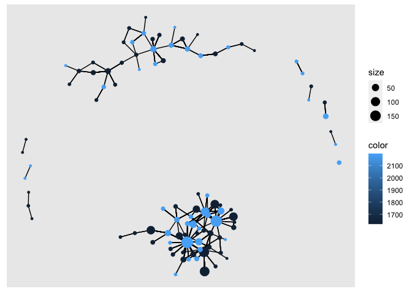

Exercise 4
================

## Including Code

``` r
data_path <- "/Users/tehuttesfayebiru/projects/2022-ona-assignments/exercises/"
applications <- read_parquet(paste0(data_path,"app_data_sample.parquet"))
edges <- read_csv(paste0(data_path,"edges_sample.csv"))
```

    ## Rows: 32906 Columns: 4
    ## ── Column specification ────────────────────────────────────────────────────────
    ## Delimiter: ","
    ## chr  (1): application_number
    ## dbl  (2): ego_examiner_id, alter_examiner_id
    ## date (1): advice_date
    ## 
    ## ℹ Use `spec()` to retrieve the full column specification for this data.
    ## ℹ Specify the column types or set `show_col_types = FALSE` to quiet this message.

## Including Plots

    ## # A tibble: 2,018,477 × 16
    ##    application_number filing_date examiner_name_last examiner_name_first
    ##    <chr>              <date>      <chr>              <chr>              
    ##  1 08284457           2000-01-26  HOWARD             JACQUELINE         
    ##  2 08413193           2000-10-11  YILDIRIM           BEKIR              
    ##  3 08531853           2000-05-17  HAMILTON           CYNTHIA            
    ##  4 08637752           2001-07-20  MOSHER             MARY               
    ##  5 08682726           2000-04-10  BARR               MICHAEL            
    ##  6 08687412           2000-04-28  GRAY               LINDA              
    ##  7 08716371           2004-01-26  MCMILLIAN          KARA               
    ##  8 08765941           2000-06-23  FORD               VANESSA            
    ##  9 08776818           2000-02-04  STRZELECKA         TERESA             
    ## 10 08809677           2002-02-20  KIM                SUN                
    ## # … with 2,018,467 more rows, and 12 more variables:
    ## #   examiner_name_middle <chr>, examiner_id <dbl>, examiner_art_unit <dbl>,
    ## #   uspc_class <chr>, uspc_subclass <chr>, patent_number <chr>,
    ## #   patent_issue_date <date>, abandon_date <date>, disposal_type <chr>,
    ## #   appl_status_code <dbl>, appl_status_date <chr>, tc <dbl>

``` r
edges
```

    ## # A tibble: 32,906 × 4
    ##    application_number advice_date ego_examiner_id alter_examiner_id
    ##    <chr>              <date>                <dbl>             <dbl>
    ##  1 09402488           2008-11-17            84356             66266
    ##  2 09402488           2008-11-17            84356             63519
    ##  3 09402488           2008-11-17            84356             98531
    ##  4 09445135           2008-08-21            92953             71313
    ##  5 09445135           2008-08-21            92953             93865
    ##  6 09445135           2008-08-21            92953             91818
    ##  7 09479304           2008-12-15            61767             69277
    ##  8 09479304           2008-12-15            61767             92446
    ##  9 09479304           2008-12-15            61767             66805
    ## 10 09479304           2008-12-15            61767             70919
    ## # … with 32,896 more rows

## add the following variables for examiners: Gender, Race, Tenure

## Gender

``` r
# get a list of first names without repetitions
# get a list of first names without repetitions
examiner_names <- applications %>% 
  distinct(examiner_name_first)

examiner_names
```

    ## # A tibble: 2,595 × 1
    ##    examiner_name_first
    ##    <chr>              
    ##  1 JACQUELINE         
    ##  2 BEKIR              
    ##  3 CYNTHIA            
    ##  4 MARY               
    ##  5 MICHAEL            
    ##  6 LINDA              
    ##  7 KARA               
    ##  8 VANESSA            
    ##  9 TERESA             
    ## 10 SUN                
    ## # … with 2,585 more rows

``` r
# get a table of names and gender
examiner_names_gender <- examiner_names %>% 
  do(results = gender(.$examiner_name_first, method = "ssa")) %>% 
  unnest(cols = c(results), keep_empty = TRUE) %>% 
  select(
    examiner_name_first = name,
    gender,
    proportion_female
  )

examiner_names_gender
```

    ## # A tibble: 1,822 × 3
    ##    examiner_name_first gender proportion_female
    ##    <chr>               <chr>              <dbl>
    ##  1 AARON               male              0.0082
    ##  2 ABDEL               male              0     
    ##  3 ABDOU               male              0     
    ##  4 ABDUL               male              0     
    ##  5 ABDULHAKIM          male              0     
    ##  6 ABDULLAH            male              0     
    ##  7 ABDULLAHI           male              0     
    ##  8 ABIGAIL             female            0.998 
    ##  9 ABIMBOLA            female            0.944 
    ## 10 ABRAHAM             male              0.0031
    ## # … with 1,812 more rows

``` r
# remove extra colums from the gender table
examiner_names_gender <- examiner_names_gender %>% 
  select(examiner_name_first, gender)

# joining gender back to the dataset
applications <- applications %>% 
  left_join(examiner_names_gender, by = "examiner_name_first")

# cleaning up
rm(examiner_names)
rm(examiner_names_gender)
gc()
```

    ##            used  (Mb) gc trigger  (Mb) limit (Mb) max used  (Mb)
    ## Ncells  4609485 246.2    7916257 422.8         NA  5013163 267.8
    ## Vcells 49826916 380.2   95803348 731.0      16384 80142724 611.5

``` r
applications
```

    ## # A tibble: 2,018,477 × 17
    ##    application_number filing_date examiner_name_last examiner_name_first
    ##    <chr>              <date>      <chr>              <chr>              
    ##  1 08284457           2000-01-26  HOWARD             JACQUELINE         
    ##  2 08413193           2000-10-11  YILDIRIM           BEKIR              
    ##  3 08531853           2000-05-17  HAMILTON           CYNTHIA            
    ##  4 08637752           2001-07-20  MOSHER             MARY               
    ##  5 08682726           2000-04-10  BARR               MICHAEL            
    ##  6 08687412           2000-04-28  GRAY               LINDA              
    ##  7 08716371           2004-01-26  MCMILLIAN          KARA               
    ##  8 08765941           2000-06-23  FORD               VANESSA            
    ##  9 08776818           2000-02-04  STRZELECKA         TERESA             
    ## 10 08809677           2002-02-20  KIM                SUN                
    ## # … with 2,018,467 more rows, and 13 more variables:
    ## #   examiner_name_middle <chr>, examiner_id <dbl>, examiner_art_unit <dbl>,
    ## #   uspc_class <chr>, uspc_subclass <chr>, patent_number <chr>,
    ## #   patent_issue_date <date>, abandon_date <date>, disposal_type <chr>,
    ## #   appl_status_code <dbl>, appl_status_date <chr>, tc <dbl>, gender <chr>

## Race

``` r
library(wru)

examiner_surnames <- applications %>% 
  select(surname = examiner_name_last) %>% 
  distinct()

examiner_surnames
```

    ## # A tibble: 3,806 × 1
    ##    surname   
    ##    <chr>     
    ##  1 HOWARD    
    ##  2 YILDIRIM  
    ##  3 HAMILTON  
    ##  4 MOSHER    
    ##  5 BARR      
    ##  6 GRAY      
    ##  7 MCMILLIAN 
    ##  8 FORD      
    ##  9 STRZELECKA
    ## 10 KIM       
    ## # … with 3,796 more rows

``` r
examiner_race <- predict_race(voter.file = examiner_surnames, surname.only = T) %>% 
  as_tibble()
```

    ## [1] "Proceeding with surname-only predictions..."

    ## Warning in merge_surnames(voter.file): Probabilities were imputed for 698
    ## surnames that could not be matched to Census list.

``` r
examiner_race
```

    ## # A tibble: 3,806 × 6
    ##    surname    pred.whi pred.bla pred.his pred.asi pred.oth
    ##    <chr>         <dbl>    <dbl>    <dbl>    <dbl>    <dbl>
    ##  1 HOWARD       0.643   0.295    0.0237   0.005     0.0333
    ##  2 YILDIRIM     0.861   0.0271   0.0609   0.0135    0.0372
    ##  3 HAMILTON     0.702   0.237    0.0245   0.0054    0.0309
    ##  4 MOSHER       0.947   0.00410  0.0241   0.00640   0.0185
    ##  5 BARR         0.827   0.117    0.0226   0.00590   0.0271
    ##  6 GRAY         0.687   0.251    0.0241   0.0054    0.0324
    ##  7 MCMILLIAN    0.359   0.574    0.0189   0.00260   0.0463
    ##  8 FORD         0.620   0.32     0.0237   0.0045    0.0313
    ##  9 STRZELECKA   0.666   0.0853   0.137    0.0797    0.0318
    ## 10 KIM          0.0252  0.00390  0.00650  0.945     0.0198
    ## # … with 3,796 more rows

``` r
examiner_race <- examiner_race %>% 
  mutate(max_race_p = pmax(pred.asi, pred.bla, pred.his, pred.oth, pred.whi)) %>% 
  mutate(race = case_when(
    max_race_p == pred.asi ~ "Asian",
    max_race_p == pred.bla ~ "black",
    max_race_p == pred.his ~ "Hispanic",
    max_race_p == pred.oth ~ "other",
    max_race_p == pred.whi ~ "white",
    TRUE ~ NA_character_
  ))

examiner_race
```

    ## # A tibble: 3,806 × 8
    ##    surname    pred.whi pred.bla pred.his pred.asi pred.oth max_race_p race 
    ##    <chr>         <dbl>    <dbl>    <dbl>    <dbl>    <dbl>      <dbl> <chr>
    ##  1 HOWARD       0.643   0.295    0.0237   0.005     0.0333      0.643 white
    ##  2 YILDIRIM     0.861   0.0271   0.0609   0.0135    0.0372      0.861 white
    ##  3 HAMILTON     0.702   0.237    0.0245   0.0054    0.0309      0.702 white
    ##  4 MOSHER       0.947   0.00410  0.0241   0.00640   0.0185      0.947 white
    ##  5 BARR         0.827   0.117    0.0226   0.00590   0.0271      0.827 white
    ##  6 GRAY         0.687   0.251    0.0241   0.0054    0.0324      0.687 white
    ##  7 MCMILLIAN    0.359   0.574    0.0189   0.00260   0.0463      0.574 black
    ##  8 FORD         0.620   0.32     0.0237   0.0045    0.0313      0.620 white
    ##  9 STRZELECKA   0.666   0.0853   0.137    0.0797    0.0318      0.666 white
    ## 10 KIM          0.0252  0.00390  0.00650  0.945     0.0198      0.945 Asian
    ## # … with 3,796 more rows

``` r
# removing extra columns
examiner_race <- examiner_race %>% 
  select(surname,race)

applications <- applications %>% 
  left_join(examiner_race, by = c("examiner_name_last" = "surname"))

rm(examiner_race)
rm(examiner_surnames)
gc()
```

    ##            used  (Mb) gc trigger  (Mb) limit (Mb) max used  (Mb)
    ## Ncells  5024222 268.4    7916257 422.8         NA  7916257 422.8
    ## Vcells 53623561 409.2   95803348 731.0      16384 94813691 723.4

``` r
applications
```

    ## # A tibble: 2,018,477 × 18
    ##    application_number filing_date examiner_name_last examiner_name_first
    ##    <chr>              <date>      <chr>              <chr>              
    ##  1 08284457           2000-01-26  HOWARD             JACQUELINE         
    ##  2 08413193           2000-10-11  YILDIRIM           BEKIR              
    ##  3 08531853           2000-05-17  HAMILTON           CYNTHIA            
    ##  4 08637752           2001-07-20  MOSHER             MARY               
    ##  5 08682726           2000-04-10  BARR               MICHAEL            
    ##  6 08687412           2000-04-28  GRAY               LINDA              
    ##  7 08716371           2004-01-26  MCMILLIAN          KARA               
    ##  8 08765941           2000-06-23  FORD               VANESSA            
    ##  9 08776818           2000-02-04  STRZELECKA         TERESA             
    ## 10 08809677           2002-02-20  KIM                SUN                
    ## # … with 2,018,467 more rows, and 14 more variables:
    ## #   examiner_name_middle <chr>, examiner_id <dbl>, examiner_art_unit <dbl>,
    ## #   uspc_class <chr>, uspc_subclass <chr>, patent_number <chr>,
    ## #   patent_issue_date <date>, abandon_date <date>, disposal_type <chr>,
    ## #   appl_status_code <dbl>, appl_status_date <chr>, tc <dbl>, gender <chr>,
    ## #   race <chr>

## Tenure

``` r
library(lubridate) # to work with dates
```

    ## 
    ## Attaching package: 'lubridate'

    ## The following object is masked from 'package:arrow':
    ## 
    ##     duration

    ## The following objects are masked from 'package:base':
    ## 
    ##     date, intersect, setdiff, union

``` r
examiner_dates <- applications %>% 
  select(examiner_id, filing_date, appl_status_date) 

examiner_dates
```

    ## # A tibble: 2,018,477 × 3
    ##    examiner_id filing_date appl_status_date  
    ##          <dbl> <date>      <chr>             
    ##  1       96082 2000-01-26  30jan2003 00:00:00
    ##  2       87678 2000-10-11  27sep2010 00:00:00
    ##  3       63213 2000-05-17  30mar2009 00:00:00
    ##  4       73788 2001-07-20  07sep2009 00:00:00
    ##  5       77294 2000-04-10  19apr2001 00:00:00
    ##  6       68606 2000-04-28  16jul2001 00:00:00
    ##  7       89557 2004-01-26  15may2017 00:00:00
    ##  8       97543 2000-06-23  03apr2002 00:00:00
    ##  9       98714 2000-02-04  27nov2002 00:00:00
    ## 10       65530 2002-02-20  23mar2009 00:00:00
    ## # … with 2,018,467 more rows

``` r
examiner_dates <- examiner_dates %>% 
  mutate(start_date = ymd(filing_date), end_date = as_date(dmy_hms(appl_status_date)))
```

``` r
examiner_dates <- examiner_dates %>% 
  group_by(examiner_id) %>% 
  summarise(
    earliest_date = min(start_date, na.rm = TRUE), 
    latest_date = max(end_date, na.rm = TRUE),
    tenure_days = interval(earliest_date, latest_date) %/% days(1)
    ) %>% 
  filter(year(latest_date)<2018)

examiner_dates
```

    ## # A tibble: 5,625 × 4
    ##    examiner_id earliest_date latest_date tenure_days
    ##          <dbl> <date>        <date>            <dbl>
    ##  1       59012 2004-07-28    2015-07-24         4013
    ##  2       59025 2009-10-26    2017-05-18         2761
    ##  3       59030 2005-12-12    2017-05-22         4179
    ##  4       59040 2007-09-11    2017-05-23         3542
    ##  5       59052 2001-08-21    2007-02-28         2017
    ##  6       59054 2000-11-10    2016-12-23         5887
    ##  7       59055 2004-11-02    2007-12-26         1149
    ##  8       59056 2000-03-24    2017-05-22         6268
    ##  9       59074 2000-01-31    2017-03-17         6255
    ## 10       59081 2011-04-21    2017-05-19         2220
    ## # … with 5,615 more rows

``` r
applications <- applications %>% 
  left_join(examiner_dates, by = "examiner_id")

rm(examiner_dates)
gc()
```

    ##            used  (Mb) gc trigger   (Mb) limit (Mb)  max used   (Mb)
    ## Ncells  5038123 269.1   14286140  763.0         NA  14286140  763.0
    ## Vcells 66002031 503.6  138132820 1053.9      16384 137953694 1052.6

``` r
applications
```

    ## # A tibble: 2,018,477 × 21
    ##    application_number filing_date examiner_name_last examiner_name_first
    ##    <chr>              <date>      <chr>              <chr>              
    ##  1 08284457           2000-01-26  HOWARD             JACQUELINE         
    ##  2 08413193           2000-10-11  YILDIRIM           BEKIR              
    ##  3 08531853           2000-05-17  HAMILTON           CYNTHIA            
    ##  4 08637752           2001-07-20  MOSHER             MARY               
    ##  5 08682726           2000-04-10  BARR               MICHAEL            
    ##  6 08687412           2000-04-28  GRAY               LINDA              
    ##  7 08716371           2004-01-26  MCMILLIAN          KARA               
    ##  8 08765941           2000-06-23  FORD               VANESSA            
    ##  9 08776818           2000-02-04  STRZELECKA         TERESA             
    ## 10 08809677           2002-02-20  KIM                SUN                
    ## # … with 2,018,467 more rows, and 17 more variables:
    ## #   examiner_name_middle <chr>, examiner_id <dbl>, examiner_art_unit <dbl>,
    ## #   uspc_class <chr>, uspc_subclass <chr>, patent_number <chr>,
    ## #   patent_issue_date <date>, abandon_date <date>, disposal_type <chr>,
    ## #   appl_status_code <dbl>, appl_status_date <chr>, tc <dbl>, gender <chr>,
    ## #   race <chr>, earliest_date <date>, latest_date <date>, tenure_days <dbl>

## Pick two workgroups you want to focus on (remember that a workgroup is

## represented by the first 3 digits of `examiner_art_unit` value)

How do they compare on examiners’ demographics? Show summary statistics
and plots.

``` r
group_219 = applications[substr(applications$examiner_art_unit, 1,3)==219,]
group_162 = applications[substr(applications$examiner_art_unit, 1,3)==162,]
summary(group_219)
```

    ##  application_number  filing_date         examiner_name_last examiner_name_first
    ##  Length:48047       Min.   :2000-01-04   Length:48047       Length:48047       
    ##  Class :character   1st Qu.:2005-09-12   Class :character   Class :character   
    ##  Mode  :character   Median :2009-08-28   Mode  :character   Mode  :character   
    ##                     Mean   :2009-07-03                                         
    ##                     3rd Qu.:2013-07-25                                         
    ##                     Max.   :2017-04-25                                         
    ##                                                                                
    ##  examiner_name_middle  examiner_id    examiner_art_unit  uspc_class       
    ##  Length:48047         Min.   :59054   Min.   :2191      Length:48047      
    ##  Class :character     1st Qu.:67290   1st Qu.:2192      Class :character  
    ##  Mode  :character     Median :75940   Median :2194      Mode  :character  
    ##                       Mean   :79582   Mean   :2194                        
    ##                       3rd Qu.:94087   3rd Qu.:2196                        
    ##                       Max.   :99833   Max.   :2199                        
    ##                       NA's   :41                                          
    ##  uspc_subclass      patent_number      patent_issue_date   
    ##  Length:48047       Length:48047       Min.   :2003-08-12  
    ##  Class :character   Class :character   1st Qu.:2010-08-31  
    ##  Mode  :character   Mode  :character   Median :2013-07-23  
    ##                                        Mean   :2012-12-01  
    ##                                        3rd Qu.:2015-07-14  
    ##                                        Max.   :2017-06-20  
    ##                                        NA's   :16909       
    ##   abandon_date        disposal_type      appl_status_code appl_status_date  
    ##  Min.   :2003-12-23   Length:48047       Min.   : 17.0    Length:48047      
    ##  1st Qu.:2009-02-28   Class :character   1st Qu.:150.0    Class :character  
    ##  Median :2011-12-05   Mode  :character   Median :150.0    Mode  :character  
    ##  Mean   :2011-08-22                      Mean   :144.2                      
    ##  3rd Qu.:2014-06-30                      3rd Qu.:161.0                      
    ##  Max.   :2017-06-05                      Max.   :454.0                      
    ##  NA's   :38281                           NA's   :153                        
    ##        tc          gender              race           earliest_date       
    ##  Min.   :2100   Length:48047       Length:48047       Min.   :2000-01-03  
    ##  1st Qu.:2100   Class :character   Class :character   1st Qu.:2000-02-03  
    ##  Median :2100   Mode  :character   Mode  :character   Median :2001-07-23  
    ##  Mean   :2100                                         Mean   :2002-12-28  
    ##  3rd Qu.:2100                                         3rd Qu.:2005-10-27  
    ##  Max.   :2100                                         Max.   :2013-06-28  
    ##                                                       NA's   :41          
    ##   latest_date          tenure_days  
    ##  Min.   :2006-02-08   Min.   : 820  
    ##  1st Qu.:2017-05-18   1st Qu.:4221  
    ##  Median :2017-05-19   Median :5780  
    ##  Mean   :2017-05-02   Mean   :5239  
    ##  3rd Qu.:2017-05-22   3rd Qu.:6311  
    ##  Max.   :2017-05-23   Max.   :6349  
    ##  NA's   :41           NA's   :41

``` r
summary(group_162)
```

    ##  application_number  filing_date         examiner_name_last examiner_name_first
    ##  Length:141390      Min.   :2000-01-03   Length:141390      Length:141390      
    ##  Class :character   1st Qu.:2005-01-18   Class :character   Class :character   
    ##  Mode  :character   Median :2008-11-25   Mode  :character   Mode  :character   
    ##                     Mean   :2008-10-24                                         
    ##                     3rd Qu.:2012-08-23                                         
    ##                     Max.   :2017-05-09                                         
    ##                                                                                
    ##  examiner_name_middle  examiner_id    examiner_art_unit  uspc_class       
    ##  Length:141390        Min.   :59440   Min.   :1620      Length:141390     
    ##  Class :character     1st Qu.:65768   1st Qu.:1624      Class :character  
    ##  Mode  :character     Median :73364   Median :1625      Mode  :character  
    ##                       Mean   :78439   Mean   :1625                        
    ##                       3rd Qu.:93677   3rd Qu.:1626                        
    ##                       Max.   :99990   Max.   :1629                        
    ##                       NA's   :682                                         
    ##  uspc_subclass      patent_number      patent_issue_date   
    ##  Length:141390      Length:141390      Min.   :2000-08-08  
    ##  Class :character   Class :character   1st Qu.:2006-11-07  
    ##  Mode  :character   Mode  :character   Median :2011-04-19  
    ##                                        Mean   :2010-06-28  
    ##                                        3rd Qu.:2014-02-18  
    ##                                        Max.   :2017-06-20  
    ##                                        NA's   :57816       
    ##   abandon_date        disposal_type      appl_status_code appl_status_date  
    ##  Min.   :2000-06-05   Length:141390      Min.   :  1.0    Length:141390     
    ##  1st Qu.:2009-02-18   Class :character   1st Qu.:150.0    Class :character  
    ##  Median :2011-06-27   Mode  :character   Median :150.0    Mode  :character  
    ##  Mean   :2011-01-30                      Mean   :161.3                      
    ##  3rd Qu.:2013-09-09                      3rd Qu.:161.0                      
    ##  Max.   :2017-06-05                      Max.   :454.0                      
    ##  NA's   :97057                           NA's   :262                        
    ##        tc          gender              race           earliest_date       
    ##  Min.   :1600   Length:141390      Length:141390      Min.   :2000-01-03  
    ##  1st Qu.:1600   Class :character   Class :character   1st Qu.:2000-01-07  
    ##  Median :1600   Mode  :character   Mode  :character   Median :2000-02-22  
    ##  Mean   :1600                                         Mean   :2001-06-10  
    ##  3rd Qu.:1600                                         3rd Qu.:2002-10-22  
    ##  Max.   :1600                                         Max.   :2012-07-25  
    ##                                                       NA's   :4389        
    ##   latest_date          tenure_days  
    ##  Min.   :2001-09-23   Min.   : 614  
    ##  1st Qu.:2017-05-19   1st Qu.:5282  
    ##  Median :2017-05-22   Median :6262  
    ##  Mean   :2017-05-03   Mean   :5806  
    ##  3rd Qu.:2017-05-23   3rd Qu.:6340  
    ##  Max.   :2017-11-08   Max.   :6518  
    ##  NA's   :4389         NA's   :4389

``` r
# get examiner ids to use as nodes
examiner_ids = distinct(subset(applications, select=c(examiner_art_unit, examiner_id)))
examiner_ids$workgroup = substr(examiner_ids$examiner_art_unit, 1,3)
examiner_ids = examiner_ids[examiner_ids$workgroup==162 | examiner_ids$workgroup==219,]

# merge with edges dataframe to get final edge table
data.f = merge(x=edges, y=examiner_ids, by.x="ego_examiner_id", by.y="examiner_id", all.x=TRUE)
data.f = data.f %>% rename(ego_art_unit=examiner_art_unit, ego_workgroup=workgroup)
data.f = drop_na(data.f)

data.f = merge(x=data.f, y=examiner_ids, by.x="alter_examiner_id", by.y="examiner_id", all.x=TRUE)
data.f = data.f %>% rename(alter_art_unit=examiner_art_unit, alter_workgroup=workgroup)
data.f = drop_na(data.f)
```

``` r
# get unique ego and alter nodes
ego_nodes = subset(data.f, select=c(ego_examiner_id,ego_art_unit, ego_workgroup)) %>% rename(examiner_id=ego_examiner_id,art_unit=ego_art_unit,workgroup=ego_workgroup)
alter_nodes = subset(data.f, select=c(alter_examiner_id,alter_art_unit, alter_workgroup))%>% rename(examiner_id=alter_examiner_id,art_unit=alter_art_unit,workgroup=alter_workgroup)
nodes = rbind(ego_nodes, alter_nodes)
nodes = distinct(nodes)
nodes = nodes %>% group_by(examiner_id) %>% summarise(examiner_id=first(examiner_id), art_unit=first(art_unit), workgroup=first(workgroup))
library(igraph)
```

    ## 
    ## Attaching package: 'igraph'

    ## The following objects are masked from 'package:lubridate':
    ## 
    ##     %--%, union

    ## The following objects are masked from 'package:dplyr':
    ## 
    ##     as_data_frame, groups, union

    ## The following objects are masked from 'package:purrr':
    ## 
    ##     compose, simplify

    ## The following object is masked from 'package:tidyr':
    ## 
    ##     crossing

    ## The following object is masked from 'package:tibble':
    ## 
    ##     as_data_frame

    ## The following objects are masked from 'package:stats':
    ## 
    ##     decompose, spectrum

    ## The following object is masked from 'package:base':
    ## 
    ##     union

``` r
# creating network
advice_net = graph_from_data_frame(d=data.f, vertices=nodes, directed=TRUE)
```

### ### Create variable for application processing time ‘app_proc_time’ that measures the number of days (or weeks) from application filing date, until the final decision on it (patented or abandoned)

``` r
#install.packages('deparse')
#library(deparse)
#library(difftime)
```

``` r
# filter for examiner ids to consider (nodes)
applications_2 <- applications %>%
      filter(examiner_id %in% nodes$examiner_id)

# Convert to class date
applications_2 <- applications_2 %>% 
  mutate(patent_issue_date = as.Date(patent_issue_date, format = "%YYYY-%mm-%dd"))
applications_2 <- applications_2 %>% 
  mutate(abandon_date = as.Date(abandon_date, format = "%YYYY-%mm-%dd"))

app_proc_time <- c()
for (i in 1:nrow(applications_2)){
  # if patent issue date is NA, use abandon date
  if (is.na(applications[i,11])){
    #app_proc_time[i] = interval(applications_2[i,2] ,applications_2[i,11] )
    app_proc_time[i] = applications_2[i,12] - applications_2[i,2]
  }
  else{
    #app_proc_time[i] = interval(applications_2[i,2] ,applications_2[i,12] )
    app_proc_time[i] = applications_2[i,11] - applications_2[i,2]
  }
  
}

applications_2$app_proc_time = app_proc_time
```

### join with nodes dataset: add gender, race, app_proc_time, tenure and other relevant variables

``` r
# remove columns not needed for regression from the applications table
applications_2 <- applications_2 %>% 
  select(examiner_id, gender, race, app_proc_time,tenure_days)
# remove NaN values
applications_2<- na.omit(applications_2)
applications_2 <- subset(applications_2,!duplicated(applications_2$examiner_id))
# group by examiner id to get average app_proc time for each examiner
#applications_2 <- applications_2%%group_by(applications_2$examiner_id)%%summarise_at(vars(applications_2$app_proc_date,applications_2$tenure_days),mean)
#applications_3 <- aggregate(applications_2$app_proc_time, list(applications_2$examiner_id), FUN=mean) 
# joining gender back to the dataset
nodes <- nodes %>% 
  left_join(applications_2, by = "examiner_id")
```

### add centrality values as columns in nodes dataframe

``` r
Degree <- degree(advice_net, v=V(advice_net))
nodes$Degree <- Degree
Betweenness <- betweenness(advice_net)
nodes$Betweenness <- Betweenness
Closeness <- closeness(advice_net)
nodes$Closeness <- Closeness
Eigenvector <- evcent((advice_net))$vector
nodes$Eigenvector <- Eigenvector

nodes <- na.omit(nodes)
```

### Use linear regression models `lm()` to estimate the relationship between centrality and `app_proc_time`, Does this relationship differ by examiner gender? Include Interaction term

``` r
library('stargazer')
```

    ## 
    ## Please cite as:

    ##  Hlavac, Marek (2022). stargazer: Well-Formatted Regression and Summary Statistics Tables.

    ##  R package version 5.2.3. https://CRAN.R-project.org/package=stargazer

``` r
# create linear regression
lr <- lm(unlist(app_proc_time) ~ Degree +Closeness + Betweenness + Eigenvector +
           tenure_days+ art_unit + workgroup, nodes)
# view model summary
summary(lr)
```

    ## 
    ## Call:
    ## lm(formula = unlist(app_proc_time) ~ Degree + Closeness + Betweenness + 
    ##     Eigenvector + tenure_days + art_unit + workgroup, data = nodes)
    ## 
    ## Residuals:
    ##    Min     1Q Median     3Q    Max 
    ## -920.5 -503.8 -200.4  447.2 1071.2 
    ## 
    ## Coefficients:
    ##                Estimate Std. Error t value Pr(>|t|)
    ## (Intercept)  -2.540e+05  1.918e+05  -1.325    0.210
    ## Degree        9.144e-01  6.407e+00   0.143    0.889
    ## Closeness     1.222e+03  6.985e+02   1.749    0.106
    ## Betweenness  -2.741e+01  6.116e+01  -0.448    0.662
    ## Eigenvector  -1.141e+03  1.308e+03  -0.872    0.400
    ## tenure_days  -3.254e-01  2.483e-01  -1.310    0.215
    ## art_unit      1.579e+02  1.184e+02   1.334    0.207
    ## workgroup219 -8.843e+04  6.726e+04  -1.315    0.213
    ## 
    ## Residual standard error: 798 on 12 degrees of freedom
    ##   (18 observations deleted due to missingness)
    ## Multiple R-squared:  0.3697, Adjusted R-squared:  0.00208 
    ## F-statistic: 1.006 on 7 and 12 DF,  p-value: 0.4729

``` r
#stargazer(lr, type="html")
```

``` r
# create linear regression
lr2 <- lm(unlist(app_proc_time) ~ Degree +Closeness + Betweenness + Eigenvector +
           tenure_days + art_unit + workgroup + Degree*race + Degree*gender + Betweenness*race + Betweenness*gender, nodes)
# view model summary
summary(lr2)
```

    ## 
    ## Call:
    ## lm(formula = unlist(app_proc_time) ~ Degree + Closeness + Betweenness + 
    ##     Eigenvector + tenure_days + art_unit + workgroup + Degree * 
    ##     race + Degree * gender + Betweenness * race + Betweenness * 
    ##     gender, data = nodes)
    ## 
    ## Residuals:
    ##     Min      1Q  Median      3Q     Max 
    ## -853.38 -283.20  -44.93  274.61 1371.65 
    ## 
    ## Coefficients: (1 not defined because of singularities)
    ##                          Estimate Std. Error t value Pr(>|t|)
    ## (Intercept)            -3.352e+05  2.383e+05  -1.407    0.202
    ## Degree                 -1.433e+01  1.204e+02  -0.119    0.909
    ## Closeness               2.234e+03  1.706e+03   1.309    0.232
    ## Betweenness             2.695e+02  8.431e+02   0.320    0.759
    ## Eigenvector            -2.345e+02  1.375e+04  -0.017    0.987
    ## tenure_days            -5.069e-01  4.211e-01  -1.204    0.268
    ## art_unit                2.086e+02  1.469e+02   1.420    0.199
    ## workgroup219           -1.179e+05  8.335e+04  -1.414    0.200
    ## racewhite              -1.324e+03  1.971e+03  -0.672    0.523
    ## gendermale             -8.164e+00  8.861e+02  -0.009    0.993
    ## Degree:racewhite        8.687e+01  7.277e+01   1.194    0.271
    ## Degree:gendermale       1.605e+01  1.189e+02   0.135    0.896
    ## Betweenness:racewhite          NA         NA      NA       NA
    ## Betweenness:gendermale -2.797e+02  8.378e+02  -0.334    0.748
    ## 
    ## Residual standard error: 866.6 on 7 degrees of freedom
    ##   (18 observations deleted due to missingness)
    ## Multiple R-squared:  0.5663, Adjusted R-squared:  -0.1771 
    ## F-statistic: 0.7618 on 12 and 7 DF,  p-value: 0.6764

``` r
#stargazer(lr2, type="html")
```

### Visualize network

``` r
# save centrality scores
V(advice_net)$size = Degree
V(advice_net)$clos = round(Closeness,2)
V(advice_net)$bet = round(Betweenness,2)
# color by art unit
V(advice_net)$color = nodes$art_unit
```

    ## Warning in vattrs[[name]][index] <- value: number of items to replace is not a
    ## multiple of replacement length

``` r
# save scores in a data frame for easy visualization
centralities <- cbind(Degree, Closeness, Betweenness)
centralities = round(centralities,2)
centralities = data.frame(centralities)
library(ggraph)
# plot graph 
ggraph(advice_net, layout="kk") +
       geom_edge_link()+
       geom_node_point(aes(size=size, color=color), show.legend=T) 
```

<!-- -->
